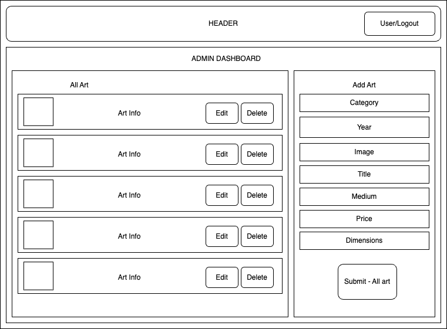

# Emma Gerigscott Art Website
## by Emma Gerigscott

### Overview
A CMS + Single-Page Application for my artwork.

### Description
This is a website for my artwork. There is an admin page that operates as a CMS, where I can upload new images and artworks as well as edit and delete existing ones. The admin page is built using React and Typescript, and the CMS is managed and built with Firebase. Admin has full CRUD functionality over website content.

The user-facing website is built with React and Typescript, and is styled with Tailwind CSS. The user can view all artworks, and click on individual artworks to view them in more detail. The user can also view a gallery of all artworks, and filter artworks by category.

I have [set up instructions](#installation-instructions), which means you can use this CMS to build your own portfolio website!

### Technologies Used & Resources
- TypeScript
- React
- [React Router](https://reactrouter.com/)
- Vite
- Firebase
- Atomic Design
- Tailwind CSS
- Custom CSS
- [Requirements Document](./TechRequirements.md)
- [Technical Design Document](./TechDesign.md)

### Installation Instructions
#### Installing Files Locally
  1. Begin by cloning this repo. At the top of this page, click on the green "Code" button and copy the SSH key.
  2. Open your terminal and navigate to the directory where you want to clone the repo.
  3. Type `git clone` and paste the SSH key you copied from the repo. Press enter.
  4. Type `cd art-website` to navigate into the project folder.
  5. Type `npm install` to install all dependencies.
  6. Type `npm run dev` to run the project locally.
#### Setting Up Firebase
  1. Navigate to [Firebase](https://firebase.google.com/) and create an account or use an existing Google account.
  2. Create a Project and choose a name for your project.
  **Note:** You can choose to enable Google Analytics, but it is not necessary for this project.

  **Adding Admin Authentication**  

  3. Click on "Develop" in the left sidebar, and then click on "Authentication".
  4. Click on "Get Started" and then click on "Email/Password" under "Sign-in method".
  5. Click "Add user" and create a user, which will be your admin, and click "Save".

  **Adding Realtime Database**  

  6. On the homepage of your project in Firebase, open the left hand menu and click the "build" tab.
  7. Click on "Realtime Database" and then click "Create Database", select 'Start in Test Mode'.
  8. Click "Next", then on the next screen leave the defaults and click Enable.
  9. Navigate back to your project homepage by clicking "Project Overview" in the left hand menu.
    - Click on the </> icon
    - Enter 'YOUR PROJECT NAME'-web as the App nickname
    - Click "Register App"
  10. Click on the settings cog next to Project Overview in the left hand menu. Select project settings.
    - Scroll down until you find a code snippet that looks like this:
```
  const firebaseConfig = {
    apiKey: "YOUR_APIKEY",
    authDomain: "YOUR_AUTHDOMAIN",
    databaseURL: "HTTPS://YOUR_DATABASEURL.COM",
    projectId: "YOUR_PROJECTID",
    storageBucket: "YOUR_STORAGEBUCKET.appspot.com",
    messagingSenderId: "YOUR_MESSAGINGSENDERID",
    appId: "YOUR_APPID",
    measurementId: "YOUR_MEASUREMENTID"
};
```
  - In your code editor, in the root file of your project, add a file called `.env` and add the following code:
```
VITE_FIREBASE_API_KEY = "YOUR_APIKEY"
VITE_FIREBASE_AUTH_DOMAIN = "YOUR_AUTHDOMAIN"
VITE_FIREBASE_PROJECT_ID = "YOUR_PROJECTID"
VITE_FIREBASE_STORAGE_BUCKET = "YOUR_STORAGEBUCKET.appspot.com"
VITE_FIREBASE_MESSAGING_SENDER_ID = "YOUR_MESSAGINGSENDERID"
VITE_FIREBASE_APP_ID = "YOUR_APPID" 
```

### Media
**Admin React Component Diagram:**  


